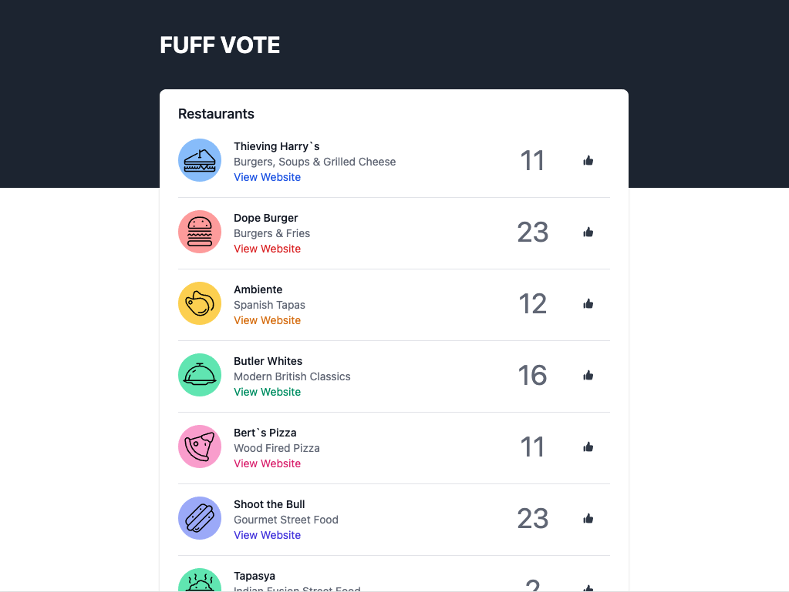

# FUFF Vote

This EmberJS project is a simple one page front end application that presents a list of Restaurants/Food Venues and allows people to vote on their favourites.

FUFF (Fucked up Food Friday) is an event the Sauce team ran pre lockdown once a month. It involved picking a local food vendor and stuffing our faces on a Friday afternoon before slipping into a food coma.

## Tasks

We'd like you to clone this repo on your own GitHub account. Make sure it's set to private. Get the app running on your machine and then work through the list of tasks.

- Each task should be submitted to your repo as a pull request before you approve and merge into the master branch.
- Pull requests should contain a good summary of the code that is being changed and why

### Feature Requests

#### Task 1

The current app presents a link to each venues website. Update the app so these automatically open in a new tab on your browser

#### Task 2

The current app presents venues in the order they were returned from the API. Update the app so Venues are always ordered by the number of votes they have.

The list should update if adding a vote changes the ranking.

The ordering should be done on the client side (ember) not the API.

#### Task 3

The current app will allow you to vote as many times as you want. Limit the user to 5 votes in total, they may vote for the same venue more than once.

This should be reset if the browser page is reloaded, there is no need to maintain state between sessions.

#### Task 4

The user can sometimes vote for the wrong venue by accident. Think of a way to allow them to "undo" a vote and implement this as a feature.

## Prerequisites

You will need the following things properly installed on your computer.

* [Git](https://git-scm.com/)
* [Node.js](https://nodejs.org/) (with npm)
* [Ember CLI](https://ember-cli.com/)
* [Google Chrome](https://google.com/chrome/)

## Installation

* `git clone git@github.com:sauce-consultants/ember-interview-task.git` this repository
* `cd fuff-vote`
* `npm install`

## Running / Development

* `ember serve`
* Visit your app at [http://localhost:4200](http://localhost:4200).
* Visit your tests at [http://localhost:4200/tests](http://localhost:4200/tests).

### Installed Packages

* [EmberCLI Mirage](https://www.ember-cli-mirage.com/) - A client-side server to help you build, test and demo your Ember app by mocking the API.
* [Ember SVG Jar](https://github.com/ivanvotti/ember-svg-jar) - Visit [http://localhost:4200/ember-svg-jar/index.html](http://localhost:4200/ember-svg-jar/index.html) while your ember app is running to view the svg icons included in the project.
* [Tailwind CSS](https://tailwindcss.com) - The CDN version of the v2.0 css framework has been included with this app. Refer to the documentation to see all the classes available should you need to make any changes to the layout.

### Running Tests

* `ember test`
* `ember test --server`

### Linting

* `npm run lint:hbs`
* `npm run lint:js`
* `npm run lint:js -- --fix`

## Further Reading / Useful Links

* [ember.js](https://emberjs.com/)
* [ember-cli](https://ember-cli.com/)
* Development Browser Extensions
  * [ember inspector for chrome](https://chrome.google.com/webstore/detail/ember-inspector/bmdblncegkenkacieihfhpjfppoconhi)
  * [ember inspector for firefox](https://addons.mozilla.org/en-US/firefox/addon/ember-inspector/)
